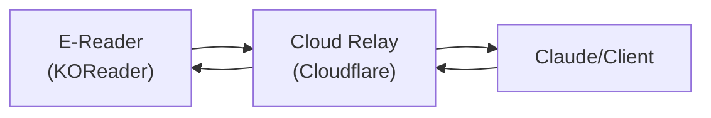
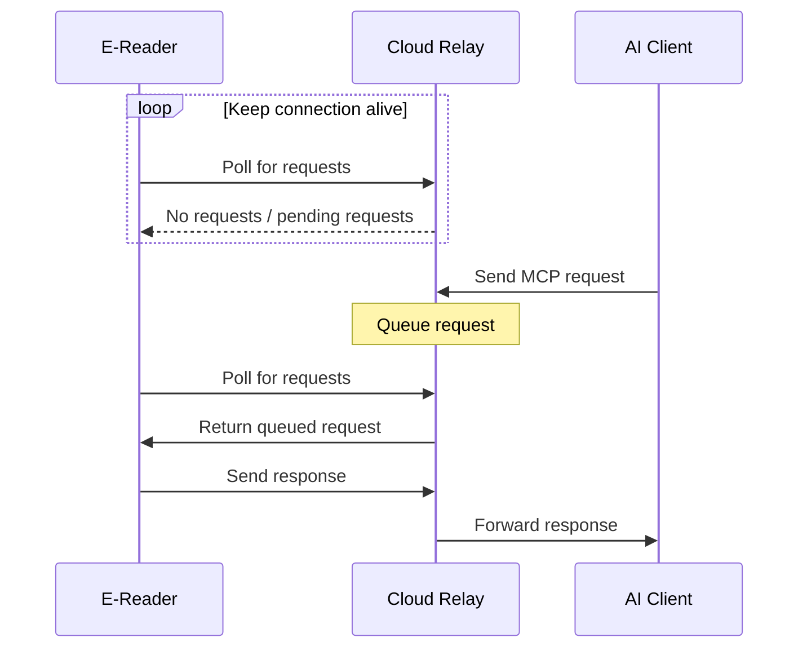

# MCP Server Plugin for KOReader

A KOReader plugin that implements a [Model Context Protocol (MCP)](https://modelcontextprotocol.io) server, enabling AI assistants to interact with your e-books in real-time.

<details><summary>What is MCP?</summary>

The Model Context Protocol (MCP) is an open standard that enables AI assistants to securely connect to external data sources and tools. This plugin implements an MCP server that exposes your KOReader book content and functionality to compatible AI assistants.

</details>

## Features

- **Book Content Access**: AI assistants can read your current book's content at different scopes (current page, chapter, specific page ranges)
- **Metadata Retrieval**: Access book metadata including title, author, reading progress, and statistics
- **Interactive Tools**: Search within books, navigate to pages, get table of contents
- **Secure Local Network**: Server binds to your local network only
- **Cloud Relay**: Access your e-reader from anywhere via a cloud relay

### Why not just use the [KOAssistant plugin](https://github.com/zeeyado/koassistant.koplugin)?

It's a great plugin and I recommend trying it out! I personally use _both_. 

- KOAssistant uses an API and requires setting up access keys (not a problem, but a bit more technical setup)
- It's very convenient for quick interaction _on-device_: e.g. translating or explaining selected text
- It's not great for longer interactions that require _typing_ which is usually a _pain on e-readers_
- While KOAssistant chats can be saved, they will not appear in your main AI assistant app's chat history (which _may_ be desired because of the memories that your AI assistant builds over time)

### Where does KOReader MCP shine?

- You are reading a book and want to have a full conversation about it with your AI assistant (e.g., Claude, ChatGPT, DeepSeek or even local LLMs)
- It can be especially useful when studying or reading on complex topics (research, philosophy, technical books), where you want to discuss ideas and brainstorm
- You can open a chat on your phone or computer, and talk to the AI about your current reading context without finicky interactions on the slow e-reader screen
- The chat _history_ and _memories_ are stored in your AI assistant app, keeping everything in one place and allowing for richer interactions over time (e.g. making connections between conversations or even different books)
  - Note: this is optional and is totally up to you how you want to use it

## Installation

> [!IMPORTANT]
> This is an early implementation. Use it at your own risk. I make **NO GUARANTEES** about stability, security, or data integrity. You're welcome to review the code and suggest improvements.

### Via an app store plugin (recommended)

Use the [App Store plugin](https://github.com/omer-faruq/appstore.koplugin) (or any other similar one) to install the MCP server plugin directly from KOReader. Simply search for "MCP" and install the plugin via the UI. This method ensures you get updates automatically.

### Manually

1. Download or clone this repository
2. Copy the `mcp.koplugin` directory to your KOReader plugins folder
3. Restart KOReader

To update, repeat the steps above with the latest version.

## Usage

### Starting the Server

1. Tap the menu (top of screen) and open 🛠️ **Tools**
2. You will see a checkbox for **MCP server**
   - Tap it to start or stop the server
   - Long-press to switch between local/remote modes or to see the details

#### Settings

1. Tap the menu and navigate to **⚙️ Settings → Network → MCP server**
2. Configure server settings:
   - **Start server automatically**: Enable to start the server when KOReader launches (requires WiFi)
   - **Idle timeout**: Set inactivity period before auto-stopping the server.  
      <sub>When the idle timeout is enabled, you'll see a warning notification 5 seconds before the server stops. Tap the notification to reset the idle timer and keep the server alive.</sub>

   - **Turn off WiFi on idle timeout**: Save battery by disabling WiFi when server stops due to idle timeout
3. Switch between local and cloud relay modes:
    - **Local mode**: Server listens on local network only
    - **Cloud relay**: Enable to use the cloud relay for remote access


> [!TIP]
> Hold any menu item to open the help tooltip

### Connecting an AI Assistant

Check the **MCP server status** in the Tools menu for the MCP server address. Use this address to configure your AI assistant or MCP client (e.g., Claude Desktop, Claude Mobile).

#### Claude

1. Go to **Settings → Connectors → Add custom connector**, or just us this link: https://claude.ai/settings/connectors?modal=add-custom-connector.
2. Enter the name (e.g., "KOReader") and the MCP server URL.
3. Open a new chat and in the ➕ menu you should see the new connector available. You can either add resources to the context, or ask it to use tools to fetch data from your book.

### Chatting About Your Book

Once connected, you can ask your AI assistant questions like:

- "What is this book about?"
- "Summarize the current chapter"
- "What does the quote on this page mean?"
- "Search for other mentions of [character/topic] on this page and explain their significance"
- "Add a note with a translation of this selected text"
- "Highlight this important passage"

Assistant will use the MCP resources and tools to understand which book you're reading, what's on your screen, search within the book, and provide relevant responses. You can also ask the assistant to add highlights and notes to your book based on your conversation.

> [!TIP]
> It might be helpful to create a separate project with more focused instructions for using KOReader MCP or even for a particular book that you want to discuss with your AI assistant. This will keep the context relevant and maintain separate memory for different books or topics.

## MCP server capabilities

> [!WARNING]
> This is an early implementation and this list may change and be not up-to-date.

### Resources

The plugin exposes these resources:

| Resource URI                | Description                                    |
| --------------------------- | ---------------------------------------------- |
| `book://current/metadata`   | Book metadata (title, author, progress, etc.)  |
| `book://current/page`       | Current page text content                      |
| `book://current/text`       | Broader textual context (limited to 100 pages) |
| `book://current/toc`        | Table of contents                              |
| `book://current/statistics` | Reading statistics and progress                |

### Tools

The plugin provides these callable tools:

| Tool            | Description                                                                       | Parameters                                                           |
| --------------- | --------------------------------------------------------------------------------- | -------------------------------------------------------------------- |
| `get_page_text` | Get text from specific page(s)                                                    | `start_page`, `end_page` (optional)                                  |
| `search_book`   | Search for text in the book                                                       | `query`, `case_sensitive` (optional)                                 |
| `get_toc`       | Get table of contents                                                             | None                                                                 |
| `goto_page`     | Navigate to a specific page                                                       | `page`                                                               |
| `get_selection` | Get currently selected text with location info                                    | None                                                                 |
| `get_book_info` | Get detailed book information                                                     | None                                                                 |
| `add_note`      | Add highlight or note to selected text (highlight only if `note` arg is omitted) | `note` (optional), `text` (optional), `pos0` (optional), `pos1` (optional) |


## Local & Remote Modes

### Local Mode

In local mode, the MCP server runs on your e-reader and listens for connections on your local network (WiFi). This would be the default mode, but unfortunately some AI clients (most notably Claude Mobile) cannot connect to local network addresses and require a fully remote-accessible server.

So for now this mode is kept for testing and limited use with compatible clients. I've tested it with GitHub Copilot with this configuration (replace `LOCAL_IP`):

```json
"koreader": {
  "type": "http",
  "url": "http://LOCAL_IP:8788"
}
```

> [!INFO]
> If you test it with other clients in local mode, please share your experience. Or if you have ideas on how to make local mode more useful, let me know!

### Remote Mode (Cloud Relay)

The cloud relay feature allows you to access your MCP server from anywhere — Claude Desktop, Claude Mobile, or other AI tools — without complex network setup like VPNs or port forwarding.



1. Your e-reader connects to the cloud relay with a device ID
2. The relay assigns a unique URL for your device
3. You use that URL to connect your AI assistant
4. The e-reader polls the relay for incoming requests
5. When your AI assistant sends a request, it's queued at the relay
6. The e-reader picks it up on the next poll and sends the response back

After the initial device registration:



> [!IMPORTANT]
> The relay is just a bridge forwarding requests between your e-reader and AI clients. It does not store any book content or personal data. Request logs might be kept temporarily for debugging, but no content is stored long-term.

The relay implementation is open source: [koreader-mcp-cloud-relay](https://github.com/laughedelic/koreader-mcp-cloud-relay). You can deploy your own instance for full control. By default, plugin uses the relay I deployed for myself. I'll be sharing it as long as it's within the free tier limits.

#### Security

- Your device ID acts as a secret token — don't share your relay URL publicly
- All traffic is encrypted (HTTPS)
- The relay doesn't store any book content, only forwards requests
- You can reset your device ID anytime from the settings menu

> [!WARNING]
> Current implementation does not implement SSL certificate verification for the relay server 

## References

- Built for [KOReader](https://github.com/koreader/koreader)
- Implements [Model Context Protocol](https://modelcontextprotocol.io) by Anthropic
- Inspired by [koassistant.koplugin](https://github.com/zeeyado/koassistant.koplugin)
